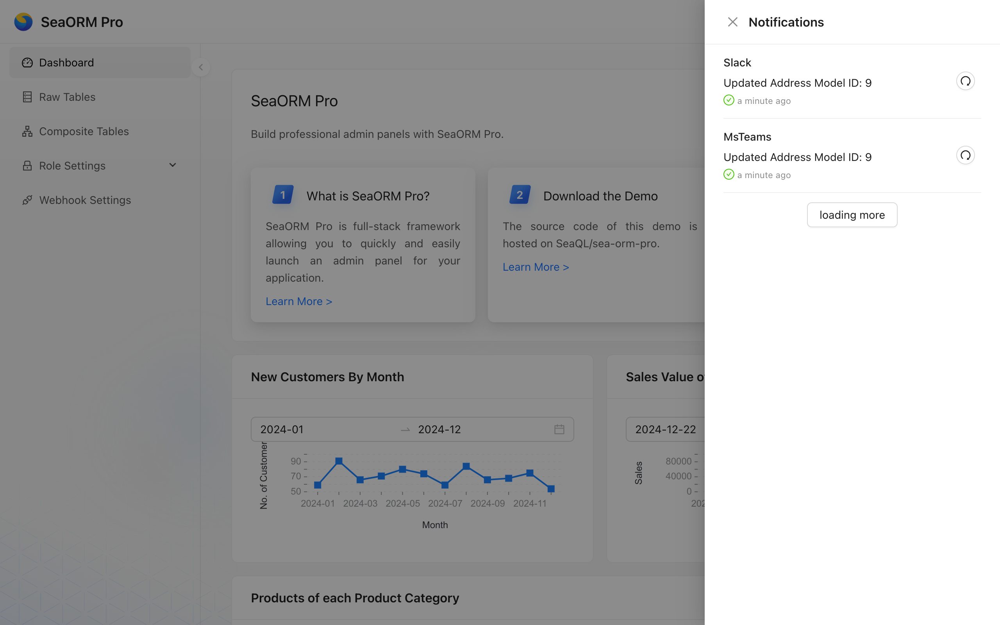

SeaORM Pro supports sending notifications to Slack and Microsoft Teams via webhooks. Once configured, applications can send notifications based on triggers: for example, when a new order is created or an order item is updated.

## The Design

#### 1. Application wide

Notifications are not personalized; any user with `select` permission on the `sea_orm_notification` table can view them in the notification panel. Users who have visibility of the designated Slack channel or Teams channel will receive these messages.

Design: application level notification center.

#### 2. Queue based

When an event is triggered in application code (for example, when a table or row is updated), a notification request is enqueued.

Design: the event queue is intended to avoid adding latency to API requests.

#### 3. Application defined

Notifications can be sent to one (unicast) or many webhooks (multicast). The application has full control over when and what to send.

Design: application-defined logic tailored to business needs.

#### 4. Background worker

A background worker picks up pending notifications from the queue and delivers them sequentially.

Design: Notifications are delivered asynchronously by the background worker, avoiding bursts while preserving the order of events.

## The Webhook

### Schema

A webhook has the following fields:

```rust
#[derive(Clone, Debug, PartialEq, Eq, DeriveEntityModel)]
#[sea_orm(table_name = "sea_orm_webhook")]
pub struct Model {
    #[sea_orm(primary_key)]
    pub id: WebhookId, // uniquely identify the webhook
    pub platform: WebhookPlatform, // can be Slack / MsTeams
    pub url: String, // webhook URL
}
```

### Config Webhook in Admin Panel

Login to the admin dashboard. If you have read & update permission of the `sea_orm_webhook` table, you should able to see the "Webhook Settings" page appear on the left:


You can perform quick update of webhook URL here.


Double check the webhook URL is correct.


### Config Webhook programatically

You can also create new webhooks using database migration, such as [m20260101_000001_webhook.rs](https://github.com/SeaQL/sea-orm-pro-plus/blob/main/migration/src/m20260101_000001_webhook.rs):

```rust
use sea_orm::{ActiveModelTrait, EntityName, NotSet, Set};
use sea_orm_migration::prelude::*;
use sea_orm_notify::entity::{notification, webhook::{self, WebhookPlatform}};
use sea_orm_rbac::context::RbacContext;

#[derive(DeriveMigrationName)]
pub struct Migration;

#[async_trait::async_trait]
impl MigrationTrait for Migration {
    async fn up(&self, manager: &SchemaManager) -> Result<(), DbErr> {
        let db = manager.get_connection();
        sea_orm_notify::create_tables(db).await?;

        webhook::ActiveModel {
            id: NotSet,
            platform: Set(WebhookPlatform::MsTeams),
            url: Set("https://teams.microsoft.com/12345678".to_owned()),
        }
        .insert(db)
        .await?;

        webhook::ActiveModel {
            id: NotSet,
            platform: Set(WebhookPlatform::Slack),
            url: Set("https://hooks.slack.com/12345678".to_owned()),
        }
        .insert(db)
        .await?;

        // ...
    }

    async fn down(&self, manager: &SchemaManager) -> Result<(), DbErr> {
        // ...
    }
}
```

### Setup Slack Webhook

The step-by-step walkthrough is available [here](https://www.sea-ql.org/sea-orm-pro/docs/notification/webhook/#setup-webhook-for-slack).

### Setup Microsoft Teams Webhook

The step-by-step walkthrough is available [here](https://www.sea-ql.org/sea-orm-pro/docs/notification/webhook/#setup-webhook-for-microsoft-teams).

## The Trigger

### Define `after_save` Trigger

A common place to trigger notification is right after a database row being inserted or updated. For example in [`address.rs`](https://github.com/SeaQL/sea-orm-pro-plus/blob/main/src/models/address.rs), we will trigger a notification after every successful insert or update:

```rust
#[async_trait::async_trait]
impl ActiveModelBehavior for ActiveModel {
    async fn after_save<C>(model: Model, db: &C, insert: bool) -> Result<Model, DbErr>
    where
        C: ConnectionTrait,
    {
        let action = if insert { "Inserted" } else { "Updated" };
        let message = format!("{action} Address Model ID: {}", model.address_id);
        sea_orm_notify::notify_all(db, &message).await?;
        tracing::info!("{message}");
        Ok(model)
    }
}
```

Of course these triggers can also be defined at individual API endpoints, where access to `DatabaseConnection` is provided.

### Unicast / Multicast

There are two methods to send notification, they are defined in [`sea-orm-notify/src/lib.rs`](https://github.com/SeaQL/sea-orm-pro-plus/blob/main/sea-orm-notify/src/lib.rs):

```rust
// Send the notification to all webhook
sea_orm_notify::notify_all(db, message).await?;

// Send the notification to a specific webhook only
sea_orm_notify::notify(db, WebhookId(1), message).await?;
```

### Formatting Messages

You can format the notification messages with basic markdown.

Note that Slack has their own [dialect](https://docs.slack.dev/messaging/formatting-message-text/).
On MS Teams, a subset of [HTML](https://learn.microsoft.com/en-us/microsoftteams/platform/resources/bot-v3/bots-text-formats) is supported. SeaORM Pro automatically compiles markdown to HTML when sending via Teams.

## The Worker

### Notification Queue and Worker

Notification will be stored in the `sea_orm_notification` table and with a column named `sent` to indicate the notification has been sent or not. A background task will send all pending notification in sequence from old to new, the source code is available at [sea-orm-notify/src/lib.rs](https://github.com/SeaQL/sea-orm-pro-plus/blob/main/sea-orm-notify/src/lib.rs).

The background task should be spawned during the initialization of the Loco app in [app.rs](https://github.com/SeaQL/sea-orm-pro-plus/blob/main/src/app.rs#L47):

```rust
pub struct App;
#[async_trait]
impl Hooks for App {
    // ...

    async fn initializers(ctx: &AppContext) -> Result<Vec<Box<dyn Initializer>>> {
        let initializers: Vec<Box<dyn Initializer>> =
            vec![Box::new(initializers::graphql::GraphQLInitializer)];

        sea_orm_notify::run_background_task(ctx.db.clone());

        Ok(initializers)
    }

    // ...
}
```

### Notification Status

The ✅ checkmark indicates that the notification was sent successfully.

You can click the `⟳` (Resend) button to resend the notification immediately.


## What's Next?

There's really a lot we want to build, to make SeaORM Pro suit the needs of every project. Please consider being a sponsor and take part in shaping its future!

Here's what we have in mind:

 * **Single Sign On**: To be able to sign-in with Google Workspace or Microsoft Business email.
 * **Audit Log**: And so, we'd want to keep a record of users' action and being able to audit them.
 * **Advanced Dashboard**: We want to make it super easy to design graphs and charts for the Admin Dashboard.
 * **Tasks**: To be able to visualize and control scheduled tasks, and kick start once off tasks in ad-hoc way.
 * **Data Export**: Export data to various formats, including CSV, Excel, and DataFrame!

## 🌟 Sponsors

#### Gold Sponsor

<a href="https://qdx.co/">
    
</a>

[QDX](https://qdx.co/) pioneers quantum dynamics-powered drug discovery, leveraging AI and supercomputing to accelerate molecular modeling.
We're grateful to QDX for sponsoring the development of SeaORM, the SQL toolkit that powers their data intensive applications.

#### GitHub Sponsors

If you feel generous, a small donation will be greatly appreciated, and goes a long way towards sustaining the organization.

A big shout out to our [GitHub sponsors](https://github.com/sponsors/SeaQL):

<div class="row">
    <div class="col col--6 margin-bottom--md">
        <div class="avatar">
            <a class="avatar__photo-link avatar__photo avatar__photo--md" href="https://github.com/sanctusgee">
                
            </a>
            <div class="avatar__intro">
                <div class="avatar__name">Godwin Effiong</div>
            </div>
        </div>
    </div>
    <div class="col col--6 margin-bottom--md">
        <div class="avatar">
            <a class="avatar__photo-link avatar__photo avatar__photo--md" href="https://github.com/ryanswrt">
                
            </a>
            <div class="avatar__intro">
                <div class="avatar__name">Ryan Swart</div>
            </div>
        </div>
    </div>
    <div class="col col--6 margin-bottom--md">
        <div class="avatar">
            <a class="avatar__photo-link avatar__photo avatar__photo--md" href="https://github.com/OteroRafael">
                
            </a>
            <div class="avatar__intro">
                <div class="avatar__name">OteroRafael</div>
            </div>
        </div>
    </div>
    <div class="col col--6 margin-bottom--md">
        <div class="avatar">
            <a class="avatar__photo-link avatar__photo avatar__photo--md" href="https://github.com/higumachan">
                
            </a>
            <div class="avatar__intro">
                <div class="avatar__name">Yuta Hinokuma</div>
            </div>
        </div>
    </div>
    <div class="col col--6 margin-bottom--md">
        <div class="avatar">
            <a class="avatar__photo-link avatar__photo avatar__photo--md" href="https://github.com/wh7f">
                
            </a>
            <div class="avatar__intro">
                <div class="avatar__name">wh7f</div>
            </div>
        </div>
    </div>
    <div class="col col--6 margin-bottom--md">
        <div class="avatar">
            <a class="avatar__photo-link avatar__photo avatar__photo--md" href="https://github.com/marcson909">
                
            </a>
            <div class="avatar__intro">
                <div class="avatar__name">MS</div>
            </div>
        </div>
    </div>
    <div class="col col--6 margin-bottom--md">
        <div class="avatar">
            <a class="avatar__photo-link avatar__photo avatar__photo--md" href="https://github.com/numeusxyz">
                
            </a>
            <div class="avatar__intro">
                <div class="avatar__name">Numeus</div>
            </div>
        </div>
    </div>
    <div class="col col--6 margin-bottom--md">
        <div class="avatar">
            <a class="avatar__photo-link avatar__photo avatar__photo--md" href="https://github.com/caido-community">
                
            </a>
            <div class="avatar__intro">
                <div class="avatar__name">Caido Community</div>
            </div>
        </div>
    </div>
    <div class="col col--6 margin-bottom--md">
        <div class="avatar">
            <a class="avatar__photo-link avatar__photo avatar__photo--md" href="https://github.com/marcusbuffett">
                
            </a>
            <div class="avatar__intro">
                <div class="avatar__name">Marcus Buffett</div>
            </div>
        </div>
    </div>
</div>
<div class="row">
    <div class="col col--4 margin-bottom--md">
        <div class="avatar">
            <a class="avatar__photo-link avatar__photo avatar__photo--sm" href="https://github.com/yuly3">
                
            </a>
            <div class="avatar__intro">
                <div class="avatar__name">MasakiMiyazaki</div>
            </div>
        </div>
    </div>
    <div class="col col--4 margin-bottom--md">
        <div class="avatar">
            <a class="avatar__photo-link avatar__photo avatar__photo--sm" href="https://github.com/kallydev">
                
            </a>
            <div class="avatar__intro">
                <div class="avatar__name">KallyDev</div>
            </div>
        </div>
    </div>
    <div class="col col--4 margin-bottom--md">
        <div class="avatar">
            <a class="avatar__photo-link avatar__photo avatar__photo--sm" href="https://github.com/manfredcml">
                
            </a>
            <div class="avatar__intro">
                <div class="avatar__name">Manfred Lee</div>
            </div>
        </div>
    </div>
    <div class="col col--4 margin-bottom--md">
        <div class="avatar">
            <a class="avatar__photo-link avatar__photo avatar__photo--sm" href="https://github.com/tugascript">
                
            </a>
            <div class="avatar__intro">
                <div class="avatar__name">Afonso Barracha</div>
            </div>
        </div>
    </div>
    <div class="col col--4 margin-bottom--md">
        <div class="avatar">
            <a class="avatar__photo-link avatar__photo avatar__photo--sm" href="https://github.com/deansheather">
                
            </a>
            <div class="avatar__intro">
                <div class="avatar__name">Dean Sheather</div>
            </div>
        </div>
    </div>
</div>

## 🦀 Rustacean Sticker Pack

The Rustacean Sticker Pack is the perfect way to express your passion for Rust.
Our stickers are made with a premium water-resistant vinyl with a unique matte finish.

Sticker Pack Contents:
- Logo of SeaQL projects: SeaQL, SeaORM, SeaQuery, Seaography
- Mascots: Ferris the Crab x 3, Terres the Hermit Crab
- The Rustacean wordmark

[Support SeaQL and get a Sticker Pack!](https://www.sea-ql.org/sticker-pack/)

<a href="https://www.sea-ql.org/sticker-pack/"></a>
