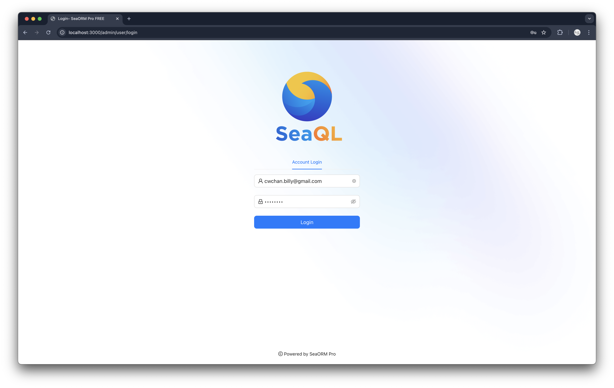
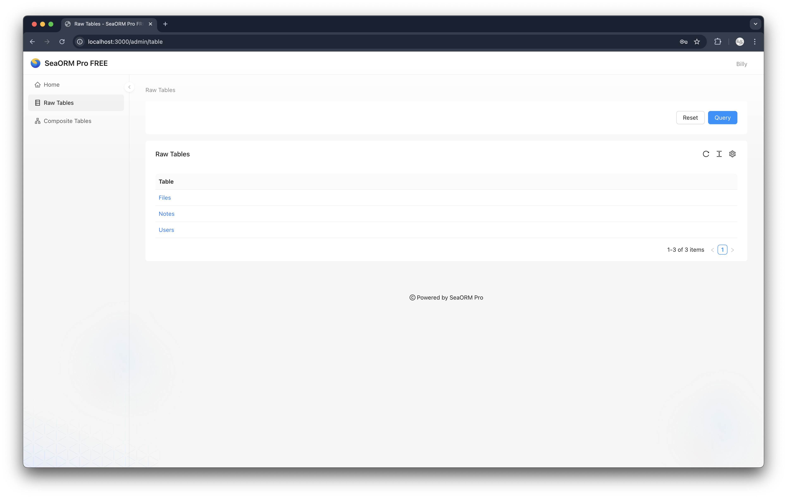
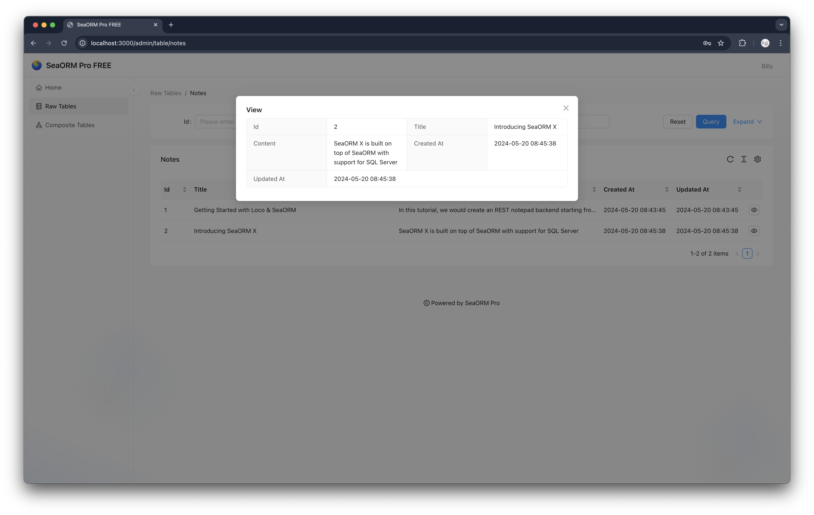
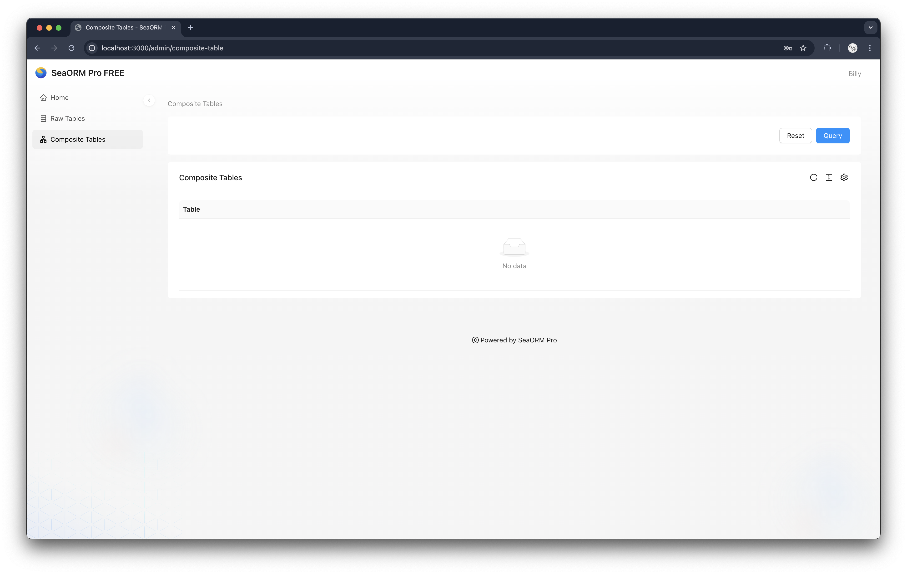

# Getting Started with Loco

We use the [`loco_starter`](https://github.com/SeaQL/sea-orm/tree/master/examples/loco_starter) example as the base, it contains basic REST API to handle basic user management such as user registration, login and user info of current session.

## 1. Setup Admin Endpoint

We will extends the SeaORM entities in the example to define a GraphQL schema, handle GraphQL request and serve SeaORM Pro admin panel.

### 1.1 Download frontend assets

```sh
# Go to the root of `loco_starter` example
cd sea-orm/examples/loco_starter

# Create a directory for the static assets
mkdir assets

# Use the `download_frontend.sh` to download SeaORM Pro FREE admin panel to `assets/admin` directory
curl "https://raw.githubusercontent.com/SeaQL/sea-orm-pro/refs/heads/main/build_tools/download_frontend.sh" -sSf | sh
```

### 1.2 Serve frontend via `static` middleware

Open Loco.rs config file, add `static` middlewares. The admin panel frontend is located in `/assets/admin` and we want to serve it under `http://localhost:3000/admin`, so we set the path as `assets`. Also, the admin panel frontend is a single page application, so we set a fallback route to the index file, `./assets/admin/index.html`.

```diff title=loco_starter/config/development.yaml
server:
  middlewares:
+   static:
+     enable: true
+     must_exist: true
+     precompressed: true
+     folder:
+       uri: /
+       path: assets
+     fallback: ./assets/admin/index.html
```

### 1.3 Setup admin API endpoint

The admin panel frontend is customizable and it read the configuration from the `api/admin/config` endpoint.

```rust title=loco_starter/src/controllers/admin.rs
use loco_rs::prelude::*;

pub async fn config(State(_ctx): State<AppContext>) -> Result<Response> {
    format::json(serde_json::json!({
        "site": {
            "theme": {
                "title": "SeaORM Pro FREE",
                "logo": "/admin/favicon.ico",
                "login_banner": "/admin/logo.png",
            }
        },
        "raw_tables": {},
        "composite_tables": {},
    }))
}

pub fn routes() -> Routes {
    Routes::new().prefix("admin").add("/config", get(config))
}
```

Use the admin controller and register the `/api/admin` route.

```diff title=loco_starter/src/controllers/mod.rs
+ pub mod admin;
pub mod auth;
pub mod files;
pub mod notes;
pub mod user;
```

```diff title=loco_starter/src/app.rs
pub struct App;

#[async_trait]
impl Hooks for App {
    fn routes(_ctx: &AppContext) -> AppRoutes {
        AppRoutes::with_default_routes()
            .prefix("/api")
            .add_route(controllers::notes::routes())
            .add_route(controllers::auth::routes())
            .add_route(controllers::user::routes())
            .add_route(controllers::files::routes())
+           .add_route(controllers::admin::routes())
    }
}
```

## 2. Setup GraphQL Endpoint

### 2.1 Define GraphQL schema

Add the dependencies for defining GraphQL schema: `async-graphql`, `seaography` and `lazy_static`.

```diff title=loco_starter/Cargo.toml
[dependencies]
+ async-graphql = { version = "7.0", features = ["decimal", "chrono", "dataloader", "dynamic-schema"] }
+ seaography = { version = "1.1.0", features = ["with-decimal", "with-chrono", "with-uuid", "field-snake-case"] }
+ lazy_static = { version = "1.4" }
```

We need to define an `RelatedEntity` enum for each of the SeaORM entity to help `seaography` figure out the parent-child relation between entities.

```diff title=loco_starter/src/models/_entities/files.rs
use sea_orm::entity::prelude::*;
use serde::{Deserialize, Serialize};

#[derive(Clone, Debug, PartialEq, DeriveEntityModel, Eq, Serialize, Deserialize)]
#[sea_orm(table_name = "files")]
pub struct Model {
    pub created_at: DateTime,
    pub updated_at: DateTime,
    #[sea_orm(primary_key)]
    pub id: i32,
    pub notes_id: i32,
    pub file_path: String,
}

#[derive(Copy, Clone, Debug, EnumIter, DeriveRelation)]
pub enum Relation {
    #[sea_orm(
        belongs_to = "super::notes::Entity",
        from = "Column::NotesId",
        to = "super::notes::Column::Id"
    )]
    Notes,
}

impl Related<super::notes::Entity> for Entity {
    fn to() -> RelationDef {
        Relation::Notes.def()
    }
}

+ #[derive(Copy, Clone, Debug, EnumIter, DeriveRelatedEntity)]
+ pub enum RelatedEntity {
+     #[sea_orm(entity = "super::notes::Entity")]
+     Notes,
+ }
```

We leave `RelatedEntity` enum empty for entity without any parent-child relation.

```diff title=loco_starter/src/models/_entities/notes.rs
use sea_orm::entity::prelude::*;
use serde::{Deserialize, Serialize};

#[derive(Clone, Debug, PartialEq, DeriveEntityModel, Eq, Serialize, Deserialize)]
#[sea_orm(table_name = "notes")]
pub struct Model {
    pub created_at: DateTime,
    pub updated_at: DateTime,
    #[sea_orm(primary_key)]
    pub id: i32,
    pub title: Option<String>,
    pub content: Option<String>,
}

#[derive(Copy, Clone, Debug, EnumIter, DeriveRelation)]
pub enum Relation {}

+ #[derive(Copy, Clone, Debug, EnumIter, DeriveRelatedEntity)]
+ pub enum RelatedEntity {}
```

```diff title=loco_starter/src/models/_entities/users.rs
use sea_orm::entity::prelude::*;
use serde::{Deserialize, Serialize};

#[derive(Clone, Debug, PartialEq, DeriveEntityModel, Eq, Serialize, Deserialize)]
#[sea_orm(table_name = "users")]
pub struct Model {
    pub created_at: DateTime,
    pub updated_at: DateTime,
    #[sea_orm(primary_key)]
    pub id: i32,
    #[sea_orm(unique)]
    pub pid: Uuid,
    #[sea_orm(unique)]
    pub email: String,
    pub password: String,
    #[sea_orm(unique)]
    pub api_key: String,
    pub name: String,
    pub reset_token: Option<String>,
    pub reset_sent_at: Option<DateTime>,
    pub email_verification_token: Option<String>,
    pub email_verification_sent_at: Option<DateTime>,
    pub email_verified_at: Option<DateTime>,
}

#[derive(Copy, Clone, Debug, EnumIter, DeriveRelation)]
pub enum Relation {}

+ #[derive(Copy, Clone, Debug, EnumIter, DeriveRelatedEntity)]
+ pub enum RelatedEntity {}
```

Use `seaography::register_entity_modules!` macros to define `register_entity_modules` boilerplate function.

```diff title=loco_starter/src/models/_entities/mod.rs
pub mod prelude;

pub mod files;
pub mod notes;
pub mod users;

+ seaography::register_entity_modules!([
+     files,
+     notes,
+     users,
+ ]);
```

Defining the GraphQL schema.

```rust title=loco_starter/src/graphql/query_root.rs
use async_graphql::dynamic::*;
use sea_orm::DatabaseConnection;
use seaography::{Builder, BuilderContext};

lazy_static::lazy_static! {
    static ref CONTEXT: BuilderContext = BuilderContext::default();
}

pub fn schema(
    database: DatabaseConnection,
    depth: Option<usize>,
    complexity: Option<usize>,
) -> Result<Schema, SchemaError> {
    // Construct GraphQL schema
    let builder = Builder::new(&CONTEXT, database.clone());
    let builder = crate::models::_entities::register_entity_modules(builder);
    let schema = builder.schema_builder();
    // Maximum depth of the constructed query
    let schema = if let Some(depth) = depth {
        schema.limit_depth(depth)
    } else {
        schema
    };
    // Maximum complexity of the constructed query
    let schema = if let Some(complexity) = complexity {
        schema.limit_complexity(complexity)
    } else {
        schema
    };
    // GraphQL schema with database connection
    schema.data(database).finish()
}
```

Use the GraphQL schema module.

```rust title=loco_starter/src/graphql/mod.rs
pub mod query_root;
```

```diff title=loco_starter/src/lib.rs
pub mod app;
pub mod controllers;
pub mod mailers;
pub mod models;
pub mod tasks;
pub mod views;
pub mod workers;
+ pub mod graphql;
```

### 2.2 Setup GraphQL playground and query root

Add dependencies for serving GraphQL playground and handling GraphQL request.

```diff title=loco_starter/Cargo.toml
[dependencies]
async-graphql = { version = "7.0", features = ["decimal", "chrono", "dataloader", "dynamic-schema"] }
+ async-graphql-axum = { version = "7.0" }
+ tower-service = { version = "0.3" }
seaography = { version = "1.1.0", features = ["with-decimal", "with-chrono", "with-uuid", "field-snake-case"] }
lazy_static = { version = "1.4" }
```

The GraphQL controller.

```rust title=loco_starter/src/controllers/graphql.rs
use async_graphql::http::{playground_source, GraphQLPlaygroundConfig};
use axum::{body::Body, extract::Request};
use loco_rs::prelude::*;
use tower_service::Service;

use crate::graphql::query_root;

async fn graphql_playground() -> Result<Response> {
    // Setup GraphQL playground web and specify the endpoint for GraphQL resolver
    let res = playground_source(GraphQLPlaygroundConfig::new("/api/graphql"));

    Ok(Response::new(res.into()))
}

async fn graphql_handler(
    _auth: auth::JWT,
    State(ctx): State<AppContext>,
    req: Request<Body>,
) -> Result<Response> {
    // Maximum depth of the constructed query
    const DEPTH: Option<usize> = None;
    // Maximum complexity of the constructed query
    const COMPLEXITY: Option<usize> = None;
    // GraphQL schema
    let schema = query_root::schema(ctx.db.clone(), DEPTH, COMPLEXITY).unwrap();
    // GraphQL handler
    let mut graphql_handler = async_graphql_axum::GraphQL::new(schema);
    let res = graphql_handler.call(req).await.unwrap();

    Ok(res)
}

pub fn routes() -> Routes {
    Routes::new()
        // GraphQL route prefix
        .prefix("graphql")
        // Serving the GraphQL playground web
        .add("/", get(graphql_playground))
        // Handling GraphQL request
        .add("/", post(graphql_handler))
}
```

Use the GraphQL controller and register the `/api/graphql` route.

```diff title=loco_starter/src/controllers/mod.rs
pub mod admin;
pub mod auth;
pub mod files;
+ pub mod graphql;
pub mod notes;
pub mod user;
```

```diff title=loco_starter/src/app.rs
pub struct App;

#[async_trait]
impl Hooks for App {
    fn routes(_ctx: &AppContext) -> AppRoutes {
        AppRoutes::with_default_routes()
            .prefix("/api")
            .add_route(controllers::notes::routes())
            .add_route(controllers::auth::routes())
            .add_route(controllers::user::routes())
            .add_route(controllers::files::routes())
            .add_route(controllers::admin::routes())
+           .add_route(controllers::graphql::routes())
    }
}
```

## 3. Launch!

```sh
$ cargo run start

   Compiling loco_starter v0.1.0 (sea-orm/examples/loco_starter)
    Finished `dev` profile [unoptimized + debuginfo] target(s) in 9.75s
     Running `target/debug/loco_starter-cli start`
2025-01-03T08:48:32.340545Z  INFO app: loco_rs::config: loading environment from selected_path="config/development.yaml" environment=development
2025-01-03T08:48:32.434077Z  INFO app: loco_rs::db: auto migrating environment=development
2025-01-03T08:48:32.437428Z  INFO app: sea_orm_migration::migrator: Applying all pending migrations environment=development
2025-01-03T08:48:32.443216Z  INFO app: sea_orm_migration::migrator: No pending migrations environment=development
2025-01-03T08:48:32.470297Z  INFO app: loco_rs::controller::app_routes: [GET] /api/_ping environment=development
2025-01-03T08:48:32.470403Z  INFO app: loco_rs::controller::app_routes: [GET] /api/_health environment=development
2025-01-03T08:48:32.470470Z  INFO app: loco_rs::controller::app_routes: [GET] /api/notes environment=development
2025-01-03T08:48:32.470520Z  INFO app: loco_rs::controller::app_routes: [POST] /api/notes environment=development
2025-01-03T08:48:32.470586Z  INFO app: loco_rs::controller::app_routes: [GET] /api/notes/:id environment=development
2025-01-03T08:48:32.470644Z  INFO app: loco_rs::controller::app_routes: [DELETE] /api/notes/:id environment=development
2025-01-03T08:48:32.470691Z  INFO app: loco_rs::controller::app_routes: [POST] /api/notes/:id environment=development
2025-01-03T08:48:32.470734Z  INFO app: loco_rs::controller::app_routes: [POST] /api/auth/register environment=development
2025-01-03T08:48:32.470778Z  INFO app: loco_rs::controller::app_routes: [POST] /api/auth/verify environment=development
2025-01-03T08:48:32.470824Z  INFO app: loco_rs::controller::app_routes: [POST] /api/auth/login environment=development
2025-01-03T08:48:32.470880Z  INFO app: loco_rs::controller::app_routes: [POST] /api/auth/forgot environment=development
2025-01-03T08:48:32.470946Z  INFO app: loco_rs::controller::app_routes: [POST] /api/auth/reset environment=development
2025-01-03T08:48:32.470996Z  INFO app: loco_rs::controller::app_routes: [GET] /api/user/current environment=development
2025-01-03T08:48:32.471041Z  INFO app: loco_rs::controller::app_routes: [POST] /api/files/upload/:notes_id environment=development
2025-01-03T08:48:32.471090Z  INFO app: loco_rs::controller::app_routes: [GET] /api/files/list/:notes_id environment=development
2025-01-03T08:48:32.471144Z  INFO app: loco_rs::controller::app_routes: [GET] /api/files/view/:files_id environment=development
2025-01-03T08:48:32.471195Z  INFO app: loco_rs::controller::app_routes: [GET] /api/admin/config environment=development
2025-01-03T08:48:32.471239Z  INFO app: loco_rs::controller::app_routes: [GET] /api/graphql environment=development
2025-01-03T08:48:32.471319Z  INFO app: loco_rs::controller::app_routes: [POST] /api/graphql environment=development
2025-01-03T08:48:32.472125Z  INFO app: loco_rs::controller::app_routes: [Middleware] Adding static environment=development
2025-01-03T08:48:32.472208Z  INFO app: loco_rs::controller::app_routes: [Middleware] Enable precompressed static assets environment=development

                      ▄     ▀
                                 ▀  ▄
                  ▄       ▀     ▄  ▄ ▄▀
                                    ▄ ▀▄▄
                        ▄     ▀    ▀  ▀▄▀█▄
                                          ▀█▄
▄▄▄▄▄▄▄  ▄▄▄▄▄▄▄▄▄   ▄▄▄▄▄▄▄▄▄▄▄ ▄▄▄▄▄▄▄▄▄ ▀▀█
 ██████  █████   ███ █████   ███ █████   ███ ▀█
 ██████  █████   ███ █████   ▀▀▀ █████   ███ ▄█▄
 ██████  █████   ███ █████       █████   ███ ████▄
 ██████  █████   ███ █████   ▄▄▄ █████   ███ █████
 ██████  █████   ███  ████   ███ █████   ███ ████▀
   ▀▀▀██▄ ▀▀▀▀▀▀▀▀▀▀  ▀▀▀▀▀▀▀▀▀▀  ▀▀▀▀▀▀▀▀▀▀ ██▀
       ▀▀▀▀▀▀▀▀▀▀▀▀▀▀▀▀▀▀▀▀▀▀▀▀▀▀▀▀▀▀▀▀▀▀▀▀▀▀▀
                https://loco.rs

environment: development
   database: automigrate
     logger: debug
compilation: debug
      modes: server

listening on localhost:3000
```

Visit [http://localhost:3000/admin](http://localhost:3000/admin) and login with your registered user.









