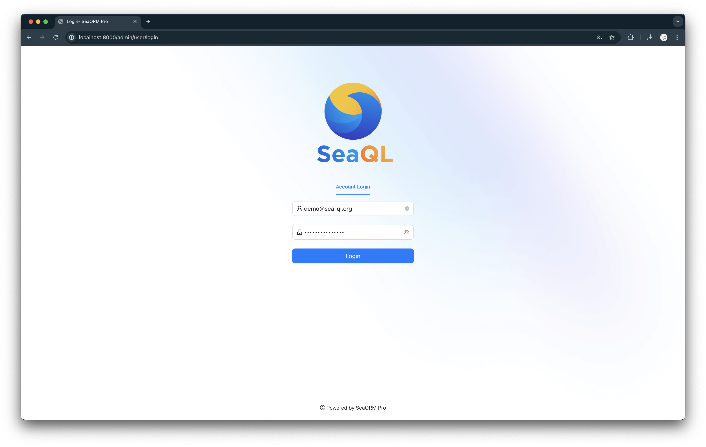

# Getting Started with Axum

We use the [`axum_example`](https://github.com/SeaQL/sea-orm/tree/master/examples/axum_example) example as the base, it contains basic REST API to handle basic user management such as user login and user info of current session.

## 1. Setup Admin Endpoint

We will extends the SeaORM entities in the example to define a GraphQL schema, handle GraphQL request and serve SeaORM Pro admin panel.

### 1.1 Download frontend assets

```sh
# Go to the api crate of `axum_example` example
cd sea-orm/examples/axum_example/api

# Create a directory for the static assets
mkdir assets

# Use the `download_frontend.sh` to download SeaORM Pro admin panel to `assets/admin` directory
curl "https://raw.githubusercontent.com/SeaQL/sea-orm-pro/refs/heads/main/build_tools/download_frontend.sh" -sSf | sh
```

### 1.2 Serve frontend via `static` middleware

Open the `lib.rs` of api crate, add `static` middlewares. The admin panel frontend is located in `/assets/admin` and we want to serve it under `http://localhost:8000/admin`, so we set the path as `/assets/admin`. Also, the admin panel frontend is a single page application, so we set a fallback route to the index file, `/assets/admin/index.html`.

```diff title=examples/axum_example/api/src/lib.rs
#[tokio::main]
async fn start() -> anyhow::Result<()> {
    let app = Router::new()
        .route("/api/auth/login", post(user_login))
        .route("/api/user/current", get(current_user))
+       .nest_service(
+           "/admin",
+           get_service(
+               ServeDir::new(concat!(
+                   env!("CARGO_MANIFEST_DIR"),
+                   "/assets/admin"
+               ))
+               .fallback(ServeFile::new(concat!(
+                   env!("CARGO_MANIFEST_DIR"),
+                   "/assets/admin/index.html"
+               )))
+           )
+       );

    let listener = tokio::net::TcpListener::bind(&server_url).await.unwrap();
    axum::serve(listener, app).await?;

    Ok(())
}
```

### 1.3 Setup admin API endpoint

The admin panel frontend is customizable and it read the configuration from the `api/admin/config` endpoint.

```rust title=examples/axum_example/api/src/lib.rs
async fn admin_panel_config(_state: State<AppState>) -> Result<Json<serde_json::Value>, (StatusCode, &'static str)> {
    Ok(Json(serde_json::json!({
        "site": {
            "theme": {
                "title": "SeaORM Pro FREE",
                "logo": "/admin/favicon.ico",
                "login_banner": "/admin/logo.png",
            }
        },
        "raw_tables": {},
        "composite_tables": {},
    })))
}
```

Use the admin controller and register the `/api/admin` route.

```diff title=examples/axum_example/api/src/lib.rs
#[tokio::main]
async fn start() -> anyhow::Result<()> {
    let app = Router::new()
+       .route("/api/admin/config", get(admin_panel_config))
        .route("/api/auth/login", post(user_login))
        .route("/api/user/current", get(current_user))
        .nest_service(
            "/admin",
            get_service(
                ServeDir::new(concat!(
                    env!("CARGO_MANIFEST_DIR"),
                    "/assets/admin"
                ))
                .fallback(ServeFile::new(concat!(
                    env!("CARGO_MANIFEST_DIR"),
                    "/assets/admin/index.html"
                )))
            )
        );

    let listener = tokio::net::TcpListener::bind(&server_url).await.unwrap();
    axum::serve(listener, app).await?;

    Ok(())
}
```

## 2. Setup GraphQL Endpoint

### 2.1 Define GraphQL schema

Add the dependencies for defining GraphQL schema: `async-graphql`, `seaography` and `lazy_static`.

```diff title=examples/axum_example/api/Cargo.toml
[dependencies]
+ async-graphql = { version = "7.0", features = ["decimal", "chrono", "dataloader", "dynamic-schema"] }
+ seaography = { version = "1.1.0", features = ["with-decimal", "with-chrono", "with-uuid", "field-snake-case"] }
+ lazy_static = { version = "1.4" }
```

We need to define an `RelatedEntity` enum for each of the SeaORM entity to help `seaography` figure out the parent-child relation between entities.

```diff title=examples/axum_example/entity/src/post.rs
use sea_orm::entity::prelude::*;
use serde::{Deserialize, Serialize};

#[derive(Clone, Debug, PartialEq, Eq, DeriveEntityModel, Serialize, Deserialize)]
#[sea_orm(table_name = "posts")]
pub struct Model {
    #[sea_orm(primary_key)]
    #[serde(skip_deserializing)]
    pub id: i32,
    pub title: String,
    #[sea_orm(column_type = "Text")]
    pub text: String,
}

#[derive(Copy, Clone, Debug, EnumIter, DeriveRelation)]
pub enum Relation {}

impl ActiveModelBehavior for ActiveModel {}

+ #[derive(Copy, Clone, Debug, EnumIter, DeriveRelatedEntity)]
+ pub enum RelatedEntity {}
```

Use `seaography::register_entity_modules!` macros to define `register_entity_modules` boilerplate function.

```diff title=examples/axum_example/api/src/graphql/query_root.rs
+ seaography::register_entity_modules!([posts]);
```

```rust title=examples/axum_example/api/src/graphql/query_root.rs
use async_graphql::dynamic::*;
use axum_example_service::sea_orm;
use axum_example_service::sea_orm::DatabaseConnection;
use seaography::{Builder, BuilderContext};

lazy_static::lazy_static! {
    static ref CONTEXT: BuilderContext = BuilderContext::default();
}

pub fn schema(
    database: DatabaseConnection,
    depth: Option<usize>,
    complexity: Option<usize>,
) -> Result<Schema, SchemaError> {
    // Construct GraphQL schema
    let builder = Builder::new(&CONTEXT, database.clone());
    let builder = register_entity_modules(builder);
    let schema = builder.schema_builder();
    // Maximum depth of the constructed query
    let schema = if let Some(depth) = depth {
        schema.limit_depth(depth)
    } else {
        schema
    };
    // Maximum complexity of the constructed query
    let schema = if let Some(complexity) = complexity {
        schema.limit_complexity(complexity)
    } else {
        schema
    };
    // GraphQL schema with database connection
    schema.data(database).finish()
}
```

Use the GraphQL schema module.

```rust title=examples/axum_example/api/src/graphql/mod.rs
pub mod query_root;
```

```diff title=examples/axum_example/api/src/lib.rs
+ mod graphql;
```

### 2.2 Setup GraphQL playground and query root

Add dependencies for serving GraphQL playground and handling GraphQL request.

```diff title=
[dependencies]
async-graphql = { version = "7.0", features = ["decimal", "chrono", "dataloader", "dynamic-schema"] }
+ async-graphql-axum = { version = "7.0" }
seaography = { version = "1.1.0", features = ["with-decimal", "with-chrono", "with-uuid", "field-snake-case"] }
lazy_static = { version = "1.4" }
```

The GraphQL controller.

```rust title=examples/axum_example/api/Cargo.toml
async fn graphql_playground() -> impl IntoResponse {
    // Setup GraphQL playground web and specify the endpoint for GraphQL resolver
    let res = playground_source(GraphQLPlaygroundConfig::new("/api/graphql"));

    Html(res)
}

async fn graphql_handler(
    state: State<AppState>,
    headers: HeaderMap,
    req: GraphQLRequest,
) -> Result<GraphQLResponse, (StatusCode, &'static str)> {
    check_user_auth(&headers)?;
    // Maximum depth of the constructed query
    const DEPTH: Option<usize> = None;
    // Maximum complexity of the constructed query
    const COMPLEXITY: Option<usize> = None;
    // GraphQL schema
    let schema = graphql::query_root::schema(state.conn.clone(), DEPTH, COMPLEXITY).unwrap();
    // GraphQL handler
    let res = schema.execute(req.into_inner()).await.into();
    Ok(res)
}
```

Use the GraphQL controller and register the `/api/graphql` route.

```diff title=examples/axum_example/api/src/lib.rs
#[tokio::main]
async fn start() -> anyhow::Result<()> {
    let app = Router::new()
        .route("/api/admin/config", get(admin_panel_config))
        .route("/api/auth/login", post(user_login))
        .route("/api/user/current", get(current_user))
+       .route("/api/graphql", get(graphql_playground))
+       .route("/api/graphql", post(graphql_handler))
        .nest_service(
            "/admin",
            get_service(
                ServeDir::new(concat!(
                    env!("CARGO_MANIFEST_DIR"),
                    "/assets/admin"
                ))
                .fallback(ServeFile::new(concat!(
                    env!("CARGO_MANIFEST_DIR"),
                    "/assets/admin/index.html"
                )))
            )
        );

    let listener = tokio::net::TcpListener::bind(&server_url).await.unwrap();
    axum::serve(listener, app).await?;

    Ok(())
}
```

## 3. Launch!

```sh
$ cargo run

    Finished `dev` profile [unoptimized + debuginfo] target(s) in 0.44s
     Running `target/debug/sea-orm-axum-example`
2025-01-08T08:08:00.048868Z DEBUG sea_orm::database::transaction: CREATE TABLE IF NOT EXISTS "seaql_migrations" ( "version" varchar NOT NULL PRIMARY KEY, "applied_at" bigint NOT NULL )
2025-01-08T08:08:00.050610Z  INFO sqlx::postgres::notice: relation "seaql_migrations" already exists, skipping
2025-01-08T08:08:00.052499Z  INFO sqlx::query: summary="CREATE TABLE IF NOT …" db.statement="\n\nCREATE TABLE IF NOT EXISTS \"seaql_migrations\" (\n  \"version\" varchar NOT NULL PRIMARY KEY,\n  \"applied_at\" bigint NOT NULL\n)\n" rows_affected=0 rows_returned=0 elapsed=1.731155ms elapsed_secs=0.001731155
2025-01-08T08:08:00.052619Z  INFO sea_orm_migration::migrator: Applying all pending migrations
2025-01-08T08:08:00.062417Z  INFO sea_orm_migration::migrator: No pending migrations
2025-01-08T08:08:00.062963Z  INFO sqlx::query: summary="COMMIT" db.statement="" rows_affected=0 rows_returned=0 elapsed=495.319µs elapsed_secs=0.000495319
2025-01-08T08:08:00.063398Z DEBUG globset: glob converted to regex: Glob { glob: "**/*", re: "(?-u)^(?:/?|.*/)[^/]*$", opts: GlobOptions { case_insensitive: false, literal_separator: true, backslash_escape: true, empty_alternates: false }, tokens: Tokens([RecursivePrefix, ZeroOrMore]) }
2025-01-08T08:08:00.063439Z DEBUG globset: built glob set; 0 literals, 0 basenames, 0 extensions, 0 prefixes, 0 suffixes, 0 required extensions, 1 regexes

```

Visit [http://localhost:8000/admin](http://localhost:8000/admin) and login with your registered user.

```
Username: demo@sea-ql.org
Password: demo@sea-ql.org
```




