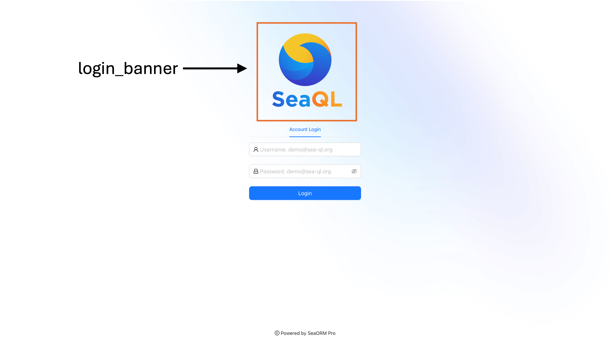

# Theme

## Full Spec

```toml
[site.theme]

# Title of admin panel
title = "SeaORM Pro"

# File path of admin panel logo
logo = "/admin/favicon.ico"

# File path of admin panel login banner
login_banner = "/admin/logo.png"


[site.menu]

# Title of "Dashboard" in the menu
dashboard = { title = "Dashboard" }

# Title of "Raw Tables" in the menu
raw_table = { title = "Raw Tables" }

# Title of "Composite Tables" in the menu
composite_table = { title = "Composite Tables" }
```




