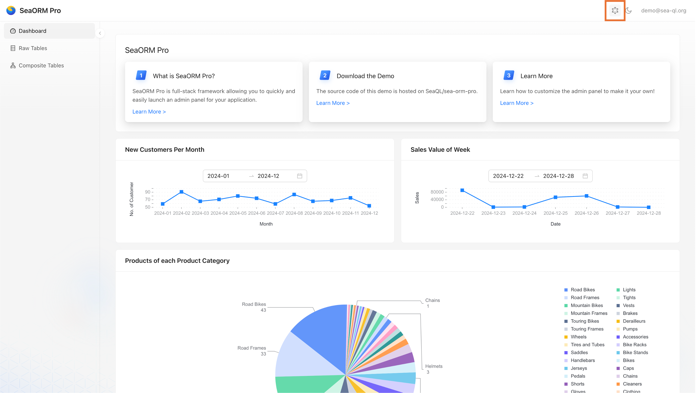

# GraphQL Playground

:::tip SeaORM Pro Plus

<br/>

SeaORM Pro is free-to-use software. All backend source code is MIT Licensed, but the frontend source code is closed for the time being.

[SeaORM Pro Plus](https://github.com/SeaQL/sea-orm-pro-plus) provides additional features and access to the frontend source code.

:::

GraphQL playground and handler is defined in the GraphQL controller:

```rust title=src/controllers/graphql.rs
use async_graphql::http::{playground_source, GraphQLPlaygroundConfig};
use axum::{body::Body, extract::Request};
use loco_rs::prelude::*;
use seaography::async_graphql;
use tower_service::Service;

use crate::graphql::query_root;

async fn graphql_playground() -> Result<Response> {
    // Setup GraphQL playground web and specify the endpoint for GraphQL resolver
    let config =
        GraphQLPlaygroundConfig::new("/api/graphql").with_header("Authorization", "AUTO_TOKEN");

    let res = playground_source(config).replace(
        r#""Authorization":"AUTO_TOKEN""#,
        r#""Authorization":`Bearer ${localStorage.getItem('auth_token')}`"#,
    );

    Ok(Response::new(res.into()))
}

async fn graphql_handler(
    _auth: auth::JWT,
    State(ctx): State<AppContext>,
    req: Request<Body>,
) -> Result<Response> {
    // Maximum depth of the constructed query
    const DEPTH: Option<usize> = None;
    // Maximum complexity of the constructed query
    const COMPLEXITY: Option<usize> = None;
    // GraphQL schema
    let schema = query_root::schema(ctx.db.clone(), DEPTH, COMPLEXITY).unwrap();
    // GraphQL handler
    let mut graphql_handler = async_graphql_axum::GraphQL::new(schema);
    let res = graphql_handler.call(req).await.unwrap();

    Ok(res)
}

pub fn routes() -> Routes {
    Routes::new()
        // GraphQL route prefix
        .prefix("graphql")
        // Serving the GraphQL playground web
        .add("/", get(graphql_playground))
        // Handling GraphQL request
        .add("/", post(graphql_handler))
}
```

After login, visit the GraphQL playground by clicking GraphQL icon on the top-right corner.



You should see the "Bearer Token" has been applied automatically.


A sample query:

```graphql
query {
  customer(
    order_by: { customer_id: ASC }
    pagination: { page: { limit: 10, page: 0 } }
  ) {
    nodes {
      customer_id
      title
      first_name
      middle_name
      last_name
    }
    pagination_info {
      current
      pages
      offset
      total
    }
  }
}
```
