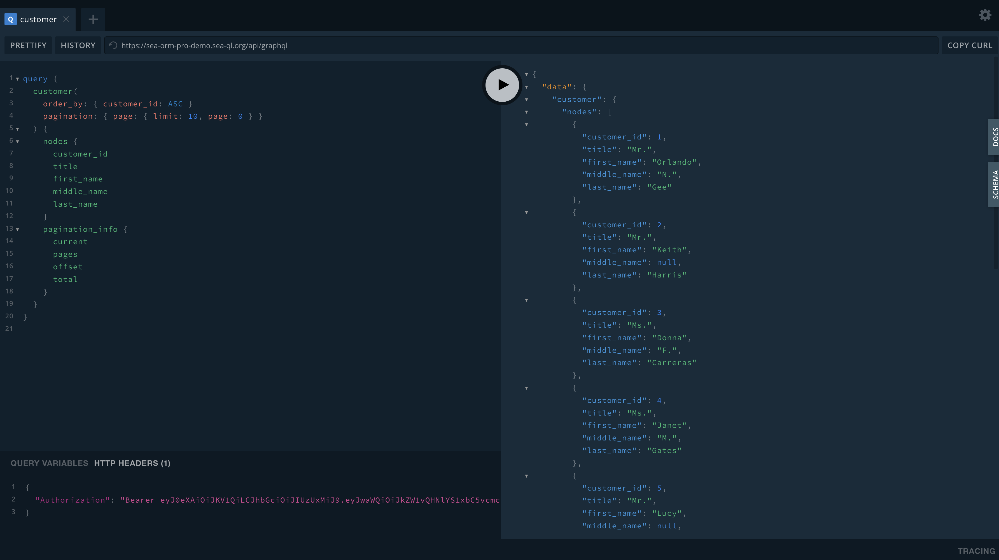

# GraphQL Playground

GraphQL playground and handler is defined in the GraphQL controller:

```rust title=src/controllers/graphql.rs
use async_graphql::http::{playground_source, GraphQLPlaygroundConfig};
use axum::{body::Body, extract::Request};
use loco_rs::prelude::*;
use seaography::async_graphql;
use tower_service::Service;

use crate::graphql::query_root;

async fn graphql_playground() -> Result<Response> {
    // Setup GraphQL playground web and specify the endpoint for GraphQL resolver
    let config =
        GraphQLPlaygroundConfig::new("/api/graphql").with_header("Authorization", "AUTO_TOKEN");

    let res = playground_source(config).replace(
        r#""Authorization":"AUTO_TOKEN""#,
        r#""Authorization":`Bearer ${localStorage.getItem('auth_token')}`"#,
    );

    Ok(Response::new(res.into()))
}

pub fn routes() -> Routes {
    Routes::new()
        // GraphQL route prefix
        .prefix("graphql")
        // Serving the GraphQL playground web
        .add("/", get(graphql_playground))
        // Handling GraphQL request
        .add("/", post(graphql_handler))
}
```

You can disable the `graphql_playground` endpoint if you don't need it in production.

After login, visit the GraphQL playground by clicking GraphQL icon  on the top-right corner.

You should see the "Bearer Token" has been applied automatically in the bottom panel.



A sample query:

```graphql
query {
  customer(
    order_by: { customer_id: ASC }
    pagination: { page: { limit: 10, page: 0 } }
  ) {
    nodes {
      customer_id
      title
      first_name
      middle_name
      last_name
    }
    pagination_info {
      current
      pages
      offset
      total
    }
  }
}
```
